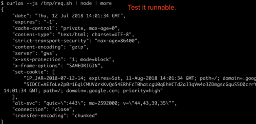
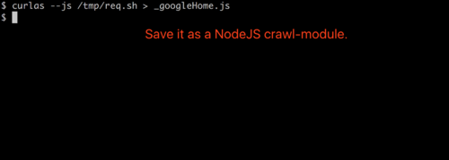

# curlas

a web spider tool

## npm install -g curlas

npm install -g curlas

## 1. Copy

Chrome / Charles / Postman, network capture


## 2. Paste
Save it to a file


## 3. compile

```bash
curlas --js /tmp/req.sh
```



## 4. Save program

```bash
curlas --js /tmp/req.sh > _googleHome.js
```



