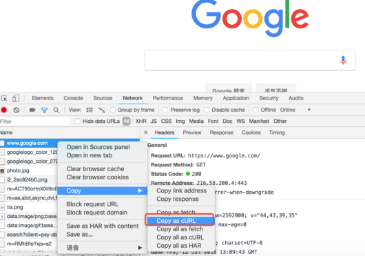

# curlas

a web spider tool

## npm install -g curlas

npm install -g curlas

## Usage

Chrome / Charles / Postman, network capture

Copy




Open up a Terminal and paste it in


```bash
cat <<"EOF" | curlas --js 
shift-insert(windows cygwin) or cmd-v(os x)
paste it
EOF
```

The output is a nodejs module

__NOTE__
windows
```
open notepad.exe
ctrl+v paste, and save it to a file, c:\req.sh for example.
open cmd.exe
curlas --js c:\req.sh
```

You can run it directly.

```bash
cat <<"EOF" | curlas --js | node | more
curl 'http://google.com/' -H 'Upgrade-Insecure-Requests: 1' \
-H 'User-Agent: Safari/537.36' \
-H 'X-DevTools-Emulate-Network-Conditions-Client-Id: \
1CC52EDD123227D4963363DF922B8CE8' --compressed
EOF
```

Or save the module into your spider project.

```bash
cat <<"EOF" | curlas --js  > ./_getList.js
curl http://localhost:8000 \
-H 'Content-Type: json' \
-H 'cookie: tk=abcd' \
-d '{"foo":"bar"}'
EOF
```

## Support language

- [x] sh
- [x] nodejs
- [ ] java
- [ ] python


